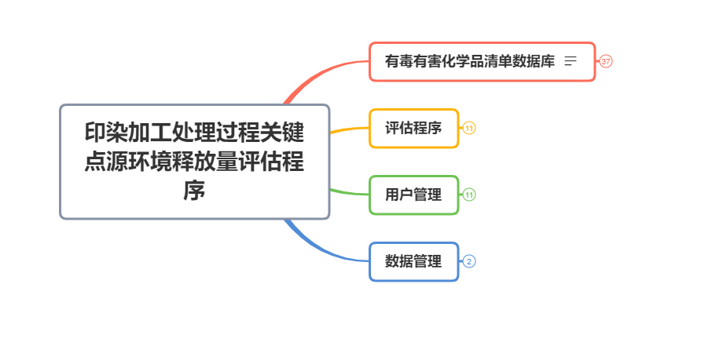

印染行业环境释放量评估程序

## 需求分析
印染加工处理过程关键点源环境释放量评估程序可以通过输入特定的物质信息及加工流程步骤等,通过公式计算出各个环节的污染排放数据,并能将数据进行导出.物质信息可以通过数据字典进行查询.

---
## 总体设计

- 有毒有害化学品清单数据库模块
- 释放量评估模块
- 用户管理模块
- 数据管理模块
---

## 技术路线
|技术|版本|说明|
|---|---|---|
|SpringBoot|2.1.3|容器+后端框架|
|Mongodb|3.2|NoSql数据库|
|Vue|-|前端框架|
|ElementUI|-|前端UI|


---
## 系统设计
### 数据字典模块
#### **添加数据**

数据字段名称及类型大小等参考文件`涂料有害物质信息库结构.xlsx`,V1.0版本目前只支持类型,名称,CAS号,水溶解度和饱和蒸汽压四种数据.


| 接口名称 | [addElement]()                                               |
|---|:--|
|请求方式|POST|
|请求路径|/element/|
|所在类|ElementController|
|参数|type:String:染料'rl'或者助剂''zj</br>name:String:染料名称</br>casNo:String:CAS编码</br>lhsxb_srjd_key_value:String:水溶解度</br>lhsxb_bhzqy_key_value:String:饱和蒸汽压|
| 返回值|Response Class (Status 200)|


#### 修改数据

对数据进行修改操作

|接口名称|[updateElement]()|
|---|:--|
|请求方式|PUT|
|请求路径|/element/id|
|所在类|ElementController|
|参数|id:String:ID</br>type:String:染料'rl'或者助剂''zj</br>name:String:染料名称</br>casNo:String:CAS编码</br>lhsxb_srjd_key_value:String:水溶解度</br>lhsxb_bhzqy_key_value:String:饱和蒸汽压|
|返回值|Response Class (Status 200)|


#### 删除数据

可以对数据进行删除操作


| 接口名称 | [delElement]()                   |
| -------- | -------------------------------- |
| 请求方式 | DELETE                           |
| 请求路径 | /element/id                      |
| 所在类   | ElementController                |
| 参数     | type:String:染料'rl'或者助剂''zj |
| 返回值   | Response Class (Status 200)      |

```json
//Response Class (Status 200)
{
  "code": 0,
  "data": {},
  "msg": "string"
}
```


#### 数据查询

+ **条件查询**
供搜索字段有:中文名\英文名\CAS号码\C.I.值,查询结果是一个列表,包含中文名,英文名,CAS号码,C.I,列,最右侧有查看按钮,点击之后可以查看该物质所有信息,根据文件`涂料有害物质信息库结构.xlsx`,分`标识信息表`,`理化属性表`,`环境行为表`,`生态危害表`,`健康危害表`,`行业信息表`这六个标签页展示.

分页条件查询接口:

| 接口名称 | [queryElemByPage]()                     |
| -------- | :-------------------------------------- |
| 请求方式 | GET                                     |
| 请求路径 | /element/{type}/{pageNumber}/{pageSize} |
| 所在类   | ElementController                       |
| 参数     | keyword:String:查询关键字               |
| 返回值   | Array,格式如下                          |
| 备注     | type分为rl和zj,分别对应染料和助剂       |

```json
{
  "content": [
    {
      "casNo": "string",
      "displayName": "string",
      "id": "string",
      "lhsxbBhzqyKeyValue": "string",
      "lhsxbSrjdKeyValue": "string"
    }
  ],
  "empty": true,
  "first": true,
  "last": true,
  "number": 0,
  "numberOfElements": 0,
  "pageable": {
    "offset": 0,
    "pageNumber": 0,
    "pageSize": 0,
    "paged": true,
    "sort": {
      "empty": true,
      "sorted": true,
      "unsorted": true
    },
    "unpaged": true
  },
  "size": 0,
  "sort": {
    "empty": true,
    "sorted": true,
    "unsorted": true
  },
  "totalElements": 0,
  "totalPages": 0
}
```


+ **分类查询**

    - **分类**:染料\助剂\全部

    | 接口名称 | [query]()            |
    | -------- | -------------------- |
    | 请求方式 | GET                  |
    | 请求路径 | /element/query       |
    | 所在类   | ElementController    |
    | 参数     | type:String:分类条件 |
    | 返回值   | Array,格式如下:      |

    ```json
    [
      {
        "casNo": "string",
        "displayName": "string",
        "id": "string",
    	"lhsxbBhzqyKeyValue": "string",
        "lhsxbSrjdKeyValue": "string"
      }
    ]
    ```

    

    - **类别**:某一类染料或者某种功能的助剂  *(待确认)*

### 释放量评估模块


### 用户管理模块
用户分为三种角色,分别如下:

| 用户类型 | 类型值 | 权限                         |
| -------- | ------ | ---------------------------- |
| 游客     | 0      | 数据查询                     |
| 普通用户 | 1      | 数据查询、数据分析           |
| 管理员   | 2      | 数据录入、数据查询、数据分析 |


#### 登录
| 接口名称 | [login]()                                       |
| -------- | ----------------------------------------------- |
| 请求方式 | POST                                            |
| 请求路径 | /login                                          |
| 所在类   | LoginController                                 |
| 参数     | username:String:用户名</br>password:String:密码 |
| 返回值   | session:String:返回该用户Session                |

#### 注册
约束条件

>1. 用户名不能重复,必须字母或者数字
>2. 密码要通过MD5加密
>3. 只能通过管理员向系统添加普通用户,用户type默认为1

| 接口名称 | [register]()                                    |
| -------- | ----------------------------------------------- |
| 请求方式 | POST                                            |
| 请求路径 | /user/                                          |
| 所在类   | UserController                                  |
| 参数     | username:String:用户名</br>password:String:密码 |
| 返回值   | Response Class (Status 200)                     |

修改用户信息

| 接口名称 | [updateUser]()                                               |
| -------- | ------------------------------------------------------------ |
| 请求方式 | PUT                                                          |
| 请求路径 | /user/user_id                                                |
| 所在类   | UserController                                               |
| 参数     | user_id:String:用户ID</br>username:String:用户名</br>password:String:密码 |
| 返回值   | Response Class (Status 200)                                  |

查询所有用户

| 接口名称 | [findAll]()    |
| -------- | -------------- |
| 请求方式 | GET            |
| 请求路径 | /user/         |
| 所在类   | UserController |
| 参数     | -              |
| 返回值   | Array          |

```json
[
    {
        "id": "5f2a10e104c52930deda1942",
        "password": "123456",
        "type": 2,
        "username": "admin"
    }
]
```

删除用户

| 接口名称 | [delUser]()                 |
| -------- | --------------------------- |
| 请求方式 | DELETE                      |
| 请求路径 | /user/user_id               |
| 所在类   | UserController              |
| 参数     | -                           |
| 返回值   | Response Class (Status 200) |

### 数据管理模块

此模块是为了满足用户想要保存计算过程，以及计算过程中的各项参数和计算结果的需求。
接口API:
1. Word文件生成API

|接口名称|[getWordFile]()|
|---|---|
|请求方式|GET|
|请求路径|/api/getWordFile|
|所在类|FileController|
|参数|idList:Array:用户所选列的数组|
|返回值|wordFile:multimedia:返回Word文件供用户下载|

2. PDF文件生成API

|接口名称|[getPdfFile]()|
|---|---|
|请求方式|GET|
|请求路径|/api/getPdfFile|
|所在类|FileController|
|参数|idList:Array:用户所选列的数组|
|返回值|pdfFile:multimedia:返回Word文件供用户下载|